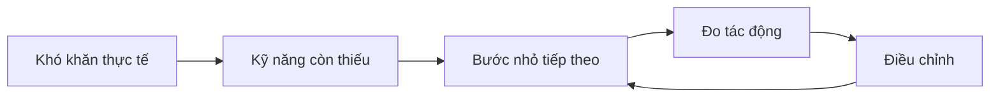
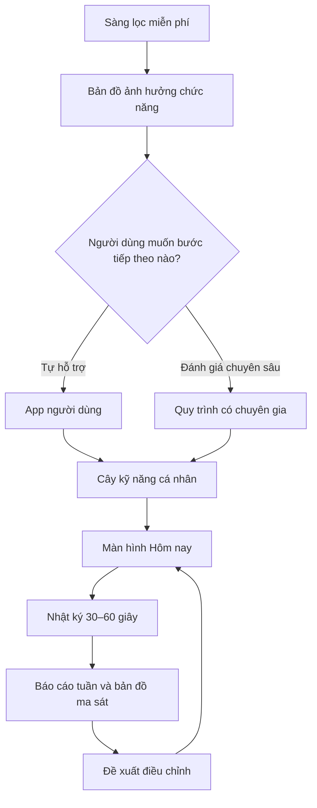
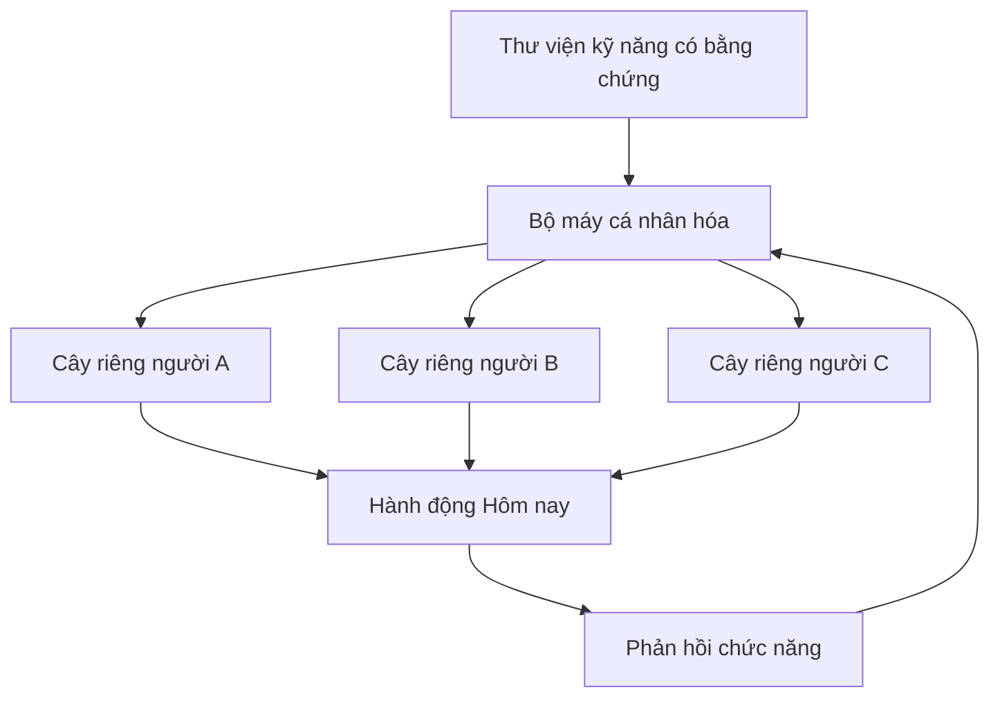

# ADHD Product Knowledge

> [!abstract] Kết luận trung tâm
> **Project ADHD Behavioral Support** là working name hiện hành cho một hệ thống giúp biến khó khăn thực tế thành một bước hành động nhỏ, đo tác động và điều chỉnh lộ trình an toàn. Web công khai phục vụ sàng lọc và cửa vào; web chuyên gia phục vụ đánh giá có trách nhiệm. **Sàng lọc không phải chẩn đoán** và hệ thống không tự đưa ra kết luận lâm sàng.

![[Attachments/adhd-product-vision-hero.png]]

> [!warning] Phạm vi của note
> Đây là knowledge note về quyết định sản phẩm, kiến trúc khái niệm, nguyên tắc an toàn và tài sản dự án. Nó không phải hướng dẫn chẩn đoán, điều trị hoặc dùng thuốc.

> [!info] Trạng thái tên sản phẩm
> `DayRoot` là tên legacy đã bị loại do brand/product collision. `Project ADHD Behavioral Support` là working name nội bộ; tên thương hiệu public chưa được chốt. Xem [[Traceability/Naming Decision Log]].

## Điều hướng nhanh

- [[#1 Luận điểm sản phẩm]]
- [[#2 Diễn tiến của ý tưởng]]
- [[#3 Hành trình người dùng]]
- [[#4 Ba bề mặt sản phẩm]]
- [[#5 Sàng lọc và nền lâm sàng]]
- [[#6 Cây kỹ năng và bản đồ công việc]]
- [[#7 Nhật ký và cơ chế thích nghi]]
- [[#8 Quyền hạn AI và guardrail]]
- [[#9 Dữ liệu và quyền riêng tư]]
- [[#10 Mô hình kinh doanh]]
- [[#11 Roadmap hiện tại]]
- [[#12 Sổ quyết định]]
- [[#13 Câu hỏi còn mở]]
- [[#14 Tài sản dự án]]
- [[#15 Nguồn session và tham khảo]]
- [[#16 Truy vết giả thuyết quyết định và rà soát lâm sàng]]

---

## 1 Luận điểm sản phẩm

### Lõi khác biệt



Lợi thế cốt lõi không phải một bài test dài hoặc một cây kỹ năng đẹp mắt. Lợi thế là bộ máy chuyển:

1. Khó khăn cụ thể trong đời sống.
2. Điểm nghẽn chức năng có thể quan sát.
3. Một bước đủ nhỏ để bắt đầu.
4. Phản hồi về tác động thực tế.
5. Điều chỉnh có giải thích và có thể hoàn tác.

### Kết quả người dùng cần nhận

- Biết việc quan trọng nhất và bước tiếp theo nhỏ nhất.
- Hiểu điều gì thường khiến mình mắc kẹt.
- Biết kỹ năng nào có ích, chưa rõ hoặc không phù hợp.
- Có lộ trình đủ ổn định để tin tưởng nhưng đủ linh hoạt để thích nghi.
- Có báo cáo rõ ràng để tự xem hoặc chia sẻ có chọn lọc với chuyên gia.

### Cách đo thành công

**Nên đo**

- Thời gian trung bình để bắt đầu việc quan trọng.
- Tỷ lệ hoàn thành việc quan trọng.
- Số lịch hẹn hoặc cam kết bị bỏ lỡ.
- Mức ảnh hưởng chức năng theo thời gian.
- Kỹ năng có ích hoặc không phù hợp.
- Gánh nặng của thông báo và tỷ lệ bỏ app.

**Không dùng làm thành tích chính**

- Thời gian ở trong app.
- Số lần mở app.
- Streak liên tục.
- Số nút cây đã mở chỉ để gamification.

### Guardrail chống productivity drift

> [!important] Task là sensor không phải mục tiêu
> Dự án dùng task để quan sát chức năng điều hành, không dùng số task hoàn thành làm định nghĩa thành công.

| Nếu feature chủ yếu tối ưu | Cảnh báo |
|---|---|
| Task completion, streak, số giờ tập trung, deadline và KPI cá nhân | Đang trôi thành productivity app |
| Hiểu bản thân, tìm pattern, giảm ma sát, điều chỉnh môi trường, phục hồi sau mất nhịp và rèn kỹ năng điều hành | Đúng định vị sản phẩm |

Chuỗi sản phẩm nên là:

```text
Understand → Support → Learn → Adapt
```

Không phải:

```text
Plan → Execute → Track → Optimize
```

Một task hoàn thành chỉ có ý nghĩa khi đặt trong chuỗi:

```text
Context → Difficulty → Support → Response → Learning
```

Ví dụ, dữ liệu có giá trị không chỉ là `Dọn phòng chưa xong 3 ngày`, mà là: task được cảm nhận quá lớn, thiếu bước đầu rõ ràng, sau khi đổi thành `gom quần áo khỏi sàn` thì người dùng bắt đầu trong vài phút.

---

## 2 Diễn tiến của ý tưởng

| Thời điểm | Chủ đề | Kiến thức bền vững |
|---|---|---|
| 14/09/2026 | Sàng lọc HTML | Bài sàng lọc người lớn chạy offline, tiếng Việt, ba mức định hướng, không tự chẩn đoán. |
| 14/09/2026 | Routine và tám tuần | Bổ sung routine tối thiểu, phục hồi sau bỏ nhịp và phân tầng mức bằng chứng; loại bỏ ngôn ngữ tái cấu trúc não. |
| 14/09/2026 | Chuyển thành product | Từ công cụ đơn lẻ sang nền tảng hỗ trợ đánh giá có chuyên gia và cây kỹ năng cá nhân. |
| 14/09/2026 | Mô hình kinh doanh | Thảo luận phễu miễn phí, chương trình kỹ năng, chuyên gia và SaaS phòng khám; loại bỏ kiếm tiền từ kết quả dương tính hoặc thuốc. |
| 14/09/2026 | Mobile first | Chốt app Android và iOS là sản phẩm chính; web người dùng và web chuyên gia có vai trò khác nhau. |
| 14/09/2026 | Cá nhân hóa | Thư viện kỹ năng dùng chung nhưng mỗi người có cây riêng theo mục tiêu, bối cảnh và ảnh hưởng chức năng. |
| 14/09/2026 | Nhật ký | Thiết kế nhật ký 30 đến 60 giây về cảm xúc, năng lượng, điều tự hào, điểm mắc kẹt và nhu cầu ngày mai. |
| 14/09/2026 | Cây thích nghi | Điều chỉnh nhỏ mỗi ngày, tái ưu tiên mỗi tuần, ba cấp quyền và luôn có hoàn tác. |
| 14–15/09/2026 | Nền lâm sàng và demo | Định nghĩa question bank có version và giấy phép; hoàn thành demo cây kỹ năng tương tác. |
| 19–20/09/2026 | Hợp nhất dự án | Đọc tài sản DayRoot legacy, lập plan application, tạo roadmap, Word summary, HTML visual showcase và vault này. |
| 20/09/2026 | Sửa trạng thái naming | Ghi nhận DayRoot đã bị loại do collision; dùng Project ADHD Behavioral Support làm working name và để public brand mở. |
| 20/09/2026 | Function Timeline | Chốt task là sensor, không phải mục tiêu; Evidence Timeline phải lưu context, difficulty, support, response và learning. |
| 20/09/2026 | Khảo sát trung tính | Tên và mô tả khảo sát không nhắc ADHD để giảm thiên lệch câu trả lời khi nghiên cứu trải nghiệm đời sống. |
| 20/09/2026 | Functional Profile | Không tạo “16 loại ADHD”; cá nhân hóa theo hồ sơ chức năng, state và môi trường. |

> [!note] Thay đổi quan trọng về ngôn ngữ
> Ý tưởng ban đầu có các cụm như “chẩn đoán miễn phí”, “biết sai ở đâu” và “làm việc như người bình thường”. Ngôn ngữ hiện tại tập trung vào **sàng lọc**, **ảnh hưởng chức năng**, **hỗ trợ phù hợp từng người** và **đánh giá có chuyên gia**.

---

## 3 Hành trình người dùng



### Sàng lọc miễn phí cung cấp

- Dấu hiệu đáng chú ý.
- Mức ảnh hưởng theo lĩnh vực.
- Yếu tố có thể gây nhiễu hoặc làm nặng.
- Giải thích giới hạn.
- Khuyến nghị bước tiếp theo.
- Kỹ năng nền có thể thử an toàn.

### Đánh giá chuyên sâu không chỉ là bài test dài hơn

Nó là một quy trình gồm:

- Bảng hỏi phù hợp và có quyền sử dụng.
- Lịch sử phát triển và dấu hiệu thời thơ ấu.
- Biểu hiện ở nhiều bối cảnh.
- Nguyên nhân khác và tình trạng đồng mắc.
- Thông tin từ người thân hoặc hồ sơ cũ khi người dùng đồng ý.
- Phỏng vấn trực tuyến với chuyên gia.
- Báo cáo, lý do và hướng tiếp theo do chuyên gia chịu trách nhiệm.

---

## 4 Ba bề mặt sản phẩm

| Bề mặt | Vai trò | Nội dung chính | Không nên làm |
|---|---|---|---|
| App người dùng | Sản phẩm chính | Hôm nay, thêm việc, task map, skill tree, nhật ký, timer, tiến triển và nhắc việc | Biến thành dashboard dày đặc hoặc game streak |
| Web sàng lọc | Cửa vào | Sàng lọc anonymous, kết quả định hướng, in PDF, thông tin sản phẩm và handoff sang app | Trả xác suất ADHD hoặc khóa kết quả sau paywall |
| Web chuyên gia | Trách nhiệm chuyên môn | Hồ sơ, timeline, bằng chứng, yếu tố gây nhiễu, ghi chú, báo cáo, rủi ro và audit | Làm giao diện mobile-first hoặc để AI ký kết luận |

### Năm màn hình MVP của app

1. **Hôm nay** — một việc chính, tối đa hai việc phụ, một kỹ năng đang luyện và nút giảm tải.
2. **Thêm công việc** — nhập hoặc nói mục tiêu; hỏi tối đa ba câu rồi để người dùng duyệt bản đồ bước.
3. **Bản đồ công việc** — bước hoàn thành, sẵn sàng, bị khóa và đang chờ thông tin.
4. **Cây kỹ năng** — năng lực dài hạn, trạng thái và lý do đề xuất.
5. **Tiến triển** — thời gian bắt đầu, việc quan trọng, lịch hẹn, ảnh hưởng chức năng và kỹ năng hữu ích.

### Nguyên tắc thông báo

- Người dùng tự chọn số lần nhắc.
- Có giờ yên lặng, hoãn 10 phút và bỏ việc hôm nay.
- Tự giảm nhắc khi người dùng liên tục bỏ qua.
- Mặc định không quá ba thông báo mỗi ngày.
- Không thông báo mất streak hoặc gây xấu hổ.

---

## 5 Sàng lọc và nền lâm sàng

### Prototype sàng lọc hiện có

- 18 câu tự xây dựng về mất tập trung và tăng động bốc đồng trong sáu tháng gần đây.
- 6 câu về ảnh hưởng chức năng.
- Dấu hiệu trước 12 tuổi.
- Biểu hiện trong ít nhất hai bối cảnh.
- Yếu tố gây nhiễu gồm ngủ, lo âu, khí sắc, stress, caffeine, thuốc và chất kích thích.
- Ba mức định hướng: Ít dấu hiệu, Nên theo dõi, Nên đi đánh giá chuyên môn sớm.
- Lưu cục bộ, in PDF và reset.

> [!important] Giới hạn của prototype
> Ngưỡng hiện tại là quy tắc định hướng tự xây dựng. Nó không phải ngưỡng chẩn đoán và không được trình bày như ASRS hoặc một thang đã được thẩm định.

### Khung câu hỏi của dự án

Khung câu hỏi hiện có 15 phần và 49 mã câu hỏi, bao phủ:

- Vấn đề hiện tại.
- Timeline cuộc đời.
- Bối cảnh.
- Bản đồ chức năng điều hành.
- Trạng thái hiện tại.
- Cơ chế bù trừ.
- Mức ảnh hưởng.
- Yếu tố gây nhiễu.
- Bằng chứng bổ sung.
- Phân nhánh.
- Dữ liệu cần lưu.
- Guardrail diễn giải.
- Flow trong app.

### Metadata bắt buộc của mỗi câu hỏi

```yaml
id: stable-question-id
version: 1.0.0
purpose: screening | function | safety | clinician
source_owner: unknown
license_status: custom | approved | blocked
language: vi-VN
recall_period: 6-months
response_type: frequency | impact | text | choice
display_condition: rule-id
escalation_condition: rule-id
reviewed_by: clinical-owner
reviewed_at: null
```

### Quy tắc dữ liệu

- `không nhớ` khác `không có`.
- `không chắc` khác `không áp dụng`.
- Thiếu dữ liệu khác dữ liệu mâu thuẫn.
- Câu hỏi không được rải trực tiếp trong mã giao diện.
- Mỗi kết quả phải truy được version câu hỏi và version rule.

### Khảo sát nghiên cứu trung tính

Khi mục tiêu là thu thập dữ liệu trải nghiệm chứ không sàng lọc lâm sàng, form không nên nhắc ADHD vì có thể định hướng người trả lời.

**Tiêu đề khuyến nghị**

> Khảo sát trải nghiệm tập trung và quản lý công việc hằng ngày

**Mô tả ngắn đã chốt**

> Khảo sát nhằm tìm hiểu cách bạn tập trung, bắt đầu công việc và xử lý lúc quá tải.

Guardrail của form nghiên cứu:

- Nói rõ không có câu trả lời đúng hoặc sai.
- Cho phép bỏ qua câu không muốn trả lời.
- Không mô tả form là bài test hoặc công cụ chẩn đoán.
- Tách dữ liệu nghiên cứu hành vi khỏi hồ sơ lâm sàng.
- Không dùng wording khiến người trả lời tự gán mọi khó khăn cho ADHD.

---

## 6 Cây kỹ năng và bản đồ công việc

### Kiến trúc khái niệm



Về dữ liệu, đây nên là một mạng phụ thuộc có hướng thay vì một cây cứng. Giao diện chỉ hiển thị nó giống skill tree để dễ hiểu.

### Dữ liệu dùng để cá nhân hóa

- Khó bắt đầu, duy trì, chuyển việc, nhớ việc hay hoàn thành.
- Bốc đồng, điều hòa cảm xúc hoặc ảnh hưởng xã hội.
- Mục tiêu do người dùng chọn.
- Bối cảnh công việc, học tập, gia đình, tài chính và quan hệ.
- Lịch làm việc, con nhỏ, người hỗ trợ, thời gian có thể dành.
- Phản hồi từ nhật ký và hành vi đã quan sát.
- Hiệu quả và gánh nặng của kỹ năng đã thử.

### Functional Profile thay vì type tính cách

ADHD có ba kiểu biểu hiện triệu chứng thường được nói tới: thiên về thiếu chú ý, thiên về tăng động bốc đồng và dạng kết hợp. Nhưng lớp cá nhân hóa của sản phẩm không nên tạo “16 loại ADHD” giống MBTI.

Sản phẩm nên dùng hồ sơ chức năng đa chiều:

| Chiều | Ví dụ đo lường |
|---|---|
| Task initiation | Thời gian từ quyết định đến bắt đầu |
| Sustained attention | Khả năng duy trì một focus block phù hợp |
| Task switching | Khả năng thoát hoặc quay lại task đúng lúc |
| Time awareness | Ước lượng so với thời gian thực tế |
| Working memory | Mức phụ thuộc vào việc phải giữ thông tin trong đầu |
| Planning and priority | Kế hoạch có phù hợp capacity thực tế không |
| Impulse regulation | Mức hậu quả của quyết định tức thời |
| Emotional regulation | Khả năng tiếp tục hoặc phục hồi khi khó chịu |
| Context sensitivity | Điều kiện môi trường nào làm chức năng tốt hoặc xấu đi |

Cùng một chẩn đoán không đồng nghĩa cùng một lộ trình sản phẩm.

### Trạng thái kỹ năng

| Trạng thái | Ý nghĩa |
|---|---|
| Chưa liên quan | Không phải ưu tiên hiện tại |
| Được đề xuất | Có dữ liệu gợi ý nhưng chưa bắt đầu |
| Sẵn sàng thử | Có điều kiện nền phù hợp |
| Đang thực hành | Một trong các kỹ năng đang được thử |
| Có ích | Người dùng và dữ liệu chức năng cho thấy lợi ích |
| Đã ổn định | Hành vi đã duy trì đủ lâu theo tiêu chí đã chốt |
| Tạm dừng | Giữ trong lịch sử nhưng chưa tiếp tục |
| Không phù hợp | Đã thử và không hữu ích hoặc gánh nặng cao |
| Cần chuyên gia | Có rủi ro hoặc liên quan lâm sàng |

> [!tip] Luật giảm tải
> Chỉ một kỹ năng chính đang luyện, tối đa hai kỹ năng hỗ trợ, một việc chính và hai việc phụ trong ngày. Thành công không tự động làm khối lượng tăng gấp đôi.

### Bản đồ công việc

Một mục tiêu lớn được biến thành tuyến đường có phụ thuộc. App luôn làm nổi bật đúng một bước có thể làm ngay.

Ví dụ:

```text
Gửi báo cáo
├─ Mở yêu cầu
├─ Chọn ba thông điệp
├─ Viết dàn ý
├─ Viết bản nháp
├─ Kiểm tra số liệu
└─ Gửi
```

Khi người dùng chọn **Việc này quá lớn**, bước `Viết dàn ý` có thể tiếp tục tách thành:

```text
Mở tài liệu → Viết tiêu đề → Gõ ba câu hỏi báo cáo cần trả lời
```

### External Brain

Sản phẩm không chỉ nhắc `Bạn còn task Làm CV`. Nó phải giữ lại:

```text
Context → Decision → Next Action → Reminder
```

Khi người dùng quay lại, app nói `Lần trước bạn dừng ở đây` và đưa đúng next action. Mục tiêu là giảm việc phải tái dựng toàn bộ bối cảnh trong working memory.

### Visual Time và time calibration

Timer không chỉ hiển thị `14:37`, mà biểu diễn lượng thời gian còn lại dưới dạng trực quan. Sau session, hệ thống có thể so sánh:

```text
Ước lượng ban đầu → Thời gian thực tế → Sai lệch theo loại task
```

Giá trị dài hạn là giúp người dùng hiệu chỉnh cảm nhận thời gian, không phải ép focus càng lâu càng tốt.

### Hyperfocus cần exit design

Focus lâu không luôn là thành công nếu người dùng quên ăn, bỏ cuộc hẹn hoặc không thoát được task. Flow phù hợp:

```text
Focus Entry → Mục tiêu → Giới hạn thời gian → Exit Check → Tiếp tục hoặc dừng → Recovery
```

---

## 7 Nhật ký và cơ chế thích nghi

### Nhật ký 30 đến 60 giây

1. Cảm xúc chính.
2. Năng lượng.
3. Việc đã làm.
4. Điều vui hoặc tự hào nhất.
5. Điều khó nhất.
6. Nguyên nhân gần nhất.
7. Ngày mai cần hỗ trợ gì.

Cảm xúc và năng lượng là hai biến riêng. App tự lấy danh sách công việc trong ngày để người dùng không phải nhập lại.

### Ba lớp bản đồ

- **Bản đồ tuần** — cảm xúc, năng lượng, việc đã làm, điểm tự hào và điểm mắc kẹt.
- **Bản đồ ma sát** — việc quá lớn, thiếu năng lượng, không rõ yêu cầu, bị gián đoạn và các nguyên nhân khác.
- **Cây kỹ năng thích nghi** — đề xuất kỹ năng, thời điểm và độ khó dựa trên mẫu lặp lại.

### Hai tốc độ điều chỉnh

| Nhịp | Có thể thay đổi | Guardrail |
|---|---|---|
| Hằng ngày | Nhiệm vụ, thời điểm, độ khó, timer, số lần nhắc, routine tối thiểu | Thay đổi nhỏ, rủi ro thấp, có giải thích và hoàn tác |
| Hằng tuần | Nhánh ưu tiên, kỹ năng mới, kỹ năng tạm dừng, cấu trúc bản đồ | Dựa trên mẫu 7–14 ngày; không đổi quá một kỹ năng chính mỗi tuần |

### Function Timeline

Tên `Evidence Timeline` dễ kéo team về hướng analytics năng suất. Tên phù hợp hơn:

- Function Timeline.
- My Pattern Timeline.
- What Helps Me.

Mỗi event nên ưu tiên:

| Trường | Ví dụ |
|---|---|
| Context | Viết báo cáo lúc 09:30 |
| State | Năng lượng trung bình, stress cao |
| Task characteristics | Hứng thú thấp, độ rõ thấp |
| Executive difficulty | Khó khởi động |
| Support used | Chia task thành bước đầu 5 phút |
| Response | Bắt đầu sau 8 phút |
| Learning | Task mơ hồ cộng stress cao làm initiation giảm |

Output dài hạn nên là pattern như `Deadline giúp khởi động nhưng tạo stress cao`, không phải `Deadline làm bạn năng suất hơn`.

### Quy tắc chống điều chỉnh quá mức

- Không thay cây từ một lần ghi nhật ký.
- Không coi một ngày xấu là xu hướng.
- Không xóa kỹ năng cũ; chuyển sang tạm dừng hoặc không phù hợp.
- Không tăng khối lượng chỉ vì một ngày thành công.
- Mọi thay đổi phải có lý do nhìn thấy được.
- Người dùng luôn có nút chỉnh và hoàn tác.

### Khi không có dữ liệu

- Không kết luận người dùng thất bại.
- Không thay đổi hồ sơ lâm sàng.
- Không mở thêm nhánh.
- Chuyển về giao diện tối thiểu.
- Đưa ra một hành động dễ quay lại.
- Không gửi hàng loạt thông báo.

---

## 8 Quyền hạn AI và guardrail

### Ba cấp quyền

| Cấp | Được phép | Không được vượt quá |
|---|---|---|
| Tự động rủi ro thấp | Chia nhỏ việc, giảm số việc, đổi timer, giảm nhắc, sắp thứ tự | Không thay hồ sơ lâm sàng hoặc kết luận mẫu hành vi quan trọng |
| Người dùng xác nhận | Đổi nhánh chính, tạm dừng mục tiêu, chia sẻ báo cáo, đưa nhật ký vào hồ sơ | Phải giải thích lý do và có chỉnh sửa hoặc hoàn tác |
| Chuyên gia quyết định | Chẩn đoán, mục tiêu điều trị, thuốc, cảnh báo tâm thần, nhánh nguy cơ | AI và hệ thống không được tự áp dụng |

### AI được phép

- Chuyển giọng nói thành văn bản.
- Tóm tắt câu trả lời.
- Đề xuất nhãn cảm xúc và ma sát.
- Chia nhỏ nhiệm vụ.
- Tìm mẫu lặp lại.
- Viết tổng kết dễ hiểu.
- Tạo một số phương án để người dùng chọn.

### AI không được phép

- Chẩn đoán ADHD hoặc bệnh đồng mắc.
- Diễn giải nhật ký thành trầm cảm, hưng cảm hoặc rối loạn khác.
- Tự thay đổi phần lâm sàng của cây.
- Tự gửi nhật ký cho chuyên gia.
- Tự liên hệ người thân hoặc cấp cứu.
- Tự áp một phác đồ hoặc kế hoạch lớn.

### Guardrail truyền thông khoa học

- Không có `Dopamine Score` hoặc thông báo `dopamine thấp hôm nay`.
- Không giải thích ADHD như trạng thái thiếu dopamine toàn não.
- Không khẳng định có một cấu trúc não ADHD đặc trưng cho từng cá nhân; khác biệt nghiên cứu thường ở mức trung bình nhóm và có độ dị biệt lớn.
- Không mô tả hyperfocus là tiêu chuẩn chẩn đoán hoặc siêu năng lực mặc định.
- Không nói thuốc là điều kiện cần cho mọi người.
- Không mặc định người ADHD sáng tạo hơn hoặc giỏi ứng biến hơn.
- Có thể hỏi người dùng `Bạn hoạt động tốt nhất trong điều kiện nào?` thay vì gán strength sẵn.

> [!success] Triết lý nên giữ
> Không cố thay đổi con người cho phù hợp với hệ thống. Hãy thay đổi hệ thống và môi trường để hành động phù hợp dễ xảy ra hơn.

> [!danger] Các hướng bị loại khỏi phạm vi sớm
> - Tự chẩn đoán.
> - Khuyên hoặc điều chỉnh thuốc.
> - Thu dữ liệu sức khỏe thật trước privacy gate.
> - AI tự áp kế hoạch.
> - Bán dữ liệu sức khỏe.
> - Nhận hoa hồng thuốc.
> - Employer dashboard xem dữ liệu cá nhân.

---

## 9 Dữ liệu và quyền riêng tư

### Mặc định

- Nhật ký thô chỉ người dùng xem.
- Chia sẻ bản tổng hợp hoặc toàn bộ là hai lựa chọn riêng.
- Chuyên gia không mặc nhiên đọc nhật ký.
- Hệ thống không tự gửi dữ liệu cho người thân.
- Có xuất dữ liệu và xóa dữ liệu.
- Giải thích rõ dữ liệu nào rời thiết bị.
- Cho phép dùng nhật ký không cần AI.

### Không thu thập âm thầm

- Vị trí.
- Tin nhắn.
- Hoạt động điện thoại.
- Dữ liệu từ app khác.
- Danh bạ hoặc người thân.

### Cổng trước dữ liệu sức khỏe thật

1. Chốt quốc gia triển khai.
2. Chốt chủ sở hữu lâm sàng và privacy owner.
3. Lập data map và mục đích của từng trường.
4. Chốt consent, retention, export và deletion.
5. Chốt nơi lưu dữ liệu và backup.
6. Threat model và kiểm thử phân quyền.
7. Incident response.
8. Independent security review.

---

## 10 Mô hình kinh doanh

### Ý tưởng từng được thảo luận

- Sàng lọc miễn phí.
- Chương trình kỹ năng tám tuần.
- Gói duy trì.
- Nhóm body doubling hoặc workshop.
- Đánh giá chuyên môn.
- SaaS phòng khám.
- Hợp đồng doanh nghiệp với dữ liệu tổng hợp.

### Quyết định hiện tại

| Nội dung | Trạng thái | Ghi chú |
|---|---|---|
| Kết quả sàng lọc | Đã chốt | Miễn phí, không khóa sau paywall |
| Khóa kỹ năng tám tuần | Đang mở | Có thể là sản phẩm chủ lực; chưa khóa giá |
| Subscription tự động | Không làm sớm | Nếu có phải minh bạch, không bật gia hạn mặc định |
| Đánh giá chuyên gia | Đang mở | Thu phí cho thời gian và trách nhiệm, không phụ thuộc kết quả |
| SaaS phòng khám | Đang mở | Sau khi chứng minh giá trị và quy trình lâm sàng |
| Bán dữ liệu hoặc hoa hồng thuốc | Bị loại | Không thuộc mô hình kinh doanh |

> [!success] Nguyên tắc định giá
> **Giá trị trước, giá sau pilot.** Mức 299.000–599.000 đồng và mốc 399.000 đồng từng được dùng để minh họa, không phải quyết định hiện hành.

---

## 11 Roadmap hiện tại

![[Attachments/roadmap-application-adhd.png]]

### Sáu giai đoạn

1. **Nền an toàn** — phạm vi, chủ sở hữu lâm sàng, quy trình nguy cơ, question license register.
2. **Domain dùng chung** — question bank, task map, skill state, adaptation rule và deterministic test.
3. **Mobile MVP** — Hôm nay, chia nhỏ việc, cây kỹ năng, offline và notification có kiểm soát.
4. **Web sàng lọc** — anonymous, kết quả định hướng, PDF và handoff an toàn.
5. **Cổng chuyên gia** — consent, phân quyền, timeline, bằng chứng, audit và báo cáo.
6. **Pilot và go/no-go** — người dùng thật, chuyên gia, hiệu quả chức năng, tác dụng không mong muốn và willingness to pay.

### Điều kiện phát hành

- Safety gate đạt.
- Có ít nhất một kết quả chức năng cải thiện.
- Không có sai lệch gây hại chưa giải thích.
- Clinical, privacy, security và accessibility cùng phê duyệt.
- Giá và monetization không làm biến dạng sàng lọc hoặc kết luận chuyên môn.

---

## 12 Sổ quyết định

### Đã chốt

| Quyết định | Nội dung |
|---|---|
| Đối tượng ban đầu | Người lớn; nội dung tiếng Việt |
| Kênh chính | Mobile first; web công khai và web chuyên gia có vai trò riêng |
| Màn hình mặc định | Hôm nay, không phải dashboard hoặc cây lớn |
| Cá nhân hóa | Mỗi người có cây riêng; MVP dùng rule minh bạch cộng quyền con người |
| Tự điều chỉnh | Nhỏ hằng ngày, tái ưu tiên hằng tuần, giải thích và hoàn tác |
| Chẩn đoán | Không tự động; chuyên gia đủ năng lực mới đưa ra kết luận |
| Định giá | Chưa khóa; nghiên cứu sau pilot |
| Dữ liệu MVP | Offline và cục bộ trước; đồng bộ khi người dùng chọn |
| Gamification | Không streak loss, trừ điểm, leaderboard bệnh nhân hoặc hộp quà ngẫu nhiên |
| Quyền riêng tư | Không bán dữ liệu, không employer access dữ liệu cá nhân, không hoa hồng thuốc |
| Task analytics | Task là sensor; không dùng output làm định nghĩa thành công |
| Cá nhân hóa lâm sàng | Functional Profile, không tạo type tính cách ADHD |
| Timeline | Theo dõi context, difficulty, support, response và learning |
| Khoa học thần kinh | Không Dopamine Score, không superpower claim, không đơn giản hóa não bộ |
| Working name | Project ADHD Behavioral Support; DayRoot là legacy; public brand chưa chốt |

### Không phải quyết định đã chốt

- Quốc gia triển khai pháp lý.
- Chuyên gia chịu trách nhiệm lâm sàng.
- Nhà cung cấp backend hoặc data hosting.
- Thang đo được cấp phép.
- Giá khóa tám tuần.
- Subscription.
- Marketplace chuyên gia.
- Mốc thời gian phát hành cụ thể.
- Tên thương hiệu public.

---

## 13 Câu hỏi còn mở

> [!question] Quyết định cần con người
> 1. Dự án triển khai pháp lý tại quốc gia nào?
> 2. Ai là clinician owner và ai phê duyệt safety flow?
> 3. Pilot đầu chỉ dùng synthetic data, usability data hay health data thật?
> 4. Nơi lưu dữ liệu nào đáp ứng residency, encryption, deletion và incident response?
> 5. Thang nào có license và bản tiếng Việt phù hợp?
> 6. Có duyệt Expo cho mobile và Next.js cho web không?
> 7. Go/no-go threshold của pilot là gì?
> 8. Mức notification burden và tác dụng không mong muốn nào là không chấp nhận được?
> 9. Người dùng được chia sẻ loại báo cáo nào với chuyên gia?
> 10. Khi nào sản phẩm đủ bằng chứng để thử pricing?
> 11. Tên public nào vượt qua domain, app collision, trademark, social handle và được Sếp phê duyệt?

---

## 14 Tài sản dự án

| Tài sản | Vai trò | Trạng thái |
|---|---|---|
| `adhd-sang-loc-nguoi-lon.html` | Screening offline, routine và lộ trình tám tuần | Đã kiểm thử |
| `demo-cay-ky-nang-adhd.html` | Skill tree thích nghi, timer và undo | Đã kiểm thử responsive |
| `DayRoot_Bo_Khung_Cau_Hoi_Khao_Sat.docx` | Khung 15 phần và 49 mã câu hỏi | Đã đọc đủ 9 trang |
| `Tong_hop_thao_luan_san_pham_ADHD.docx` | Tổng hợp toàn bộ lịch sử và quyết định | 11 trang, đã render QA |
| `plans/2026-09-19-adhd-application/` | Plan kiến trúc application sáu phase | Tham chiếu sau validation |
| `plans/2026-09-20-project-adhd-behavioral-support/` | Plan kiểm chứng Function Timeline và Pattern Map | Kế hoạch thực thi hiện hành |
| `roadmap-application-adhd.excalidraw` | Roadmap chỉnh sửa được | Hiện hành |
| `roadmap-application-adhd.png` | Roadmap xuất ảnh | Đã kiểm tra trực quan |
| `ADHD_Product_Vision.html` | Bản trình bày trực quan dùng tên DayRoot | Legacy visual |
| `Project_ADHD_Behavioral_Support.html` | Plan trực quan và diagram flow tính năng | Responsive, bilingual và interactive |
| `system-design-project-adhd-behavioral-support.excalidraw` | Kiến trúc hệ thống chỉnh sửa được | Hiện hành |
| `system-design-project-adhd-behavioral-support.png` | Bản xuất kiến trúc hệ thống | Đã kiểm tra trực quan |
| `mindmap-project-adhd-behavioral-support.excalidraw` | Mindmap phạm vi sản phẩm theo góc nhìn BA | Hiện hành, chỉnh sửa được |
| `mindmap-project-adhd-behavioral-support.png` | Bản xuất mindmap phạm vi sản phẩm | Đã kiểm tra trực quan |
| `ba-end-to-end-flow-project-adhd-behavioral-support.excalidraw` | Swimlane end-to-end: actor, decision, payment và data handoff | Hiện hành, chỉnh sửa được |
| `ba-end-to-end-flow-project-adhd-behavioral-support.png` | Bản xuất flow BA end-to-end | Đã kiểm tra trực quan |
| `Project_ADHD_Behavioral_Support_System_Design.html` | Trình bày kiến trúc hệ thống tương tác | Self-contained, bilingual và responsive |
| `output/Project_ADHD_Behavioral_Support_Final_Deck.pptx` | Slide trình bày dự án cho cố vấn và đối tác | 10 slide, editable và đã render QA |
| `Project_ADHD_Behavioral_Support_Community_Roadmap.html` | Định hướng sản phẩm, thang hỗ trợ và roadmap cộng đồng | Self-contained, bilingual và responsive |
| `output/Project_ADHD_Behavioral_Support_Project_Plan_and_Doctor_Questions.docx` | Plan dự án, knowledge và câu hỏi làm việc với bác sĩ | Hiện hành |
| `output/Portfolio_Du_An_ADHD.html` | Portfolio sản phẩm song ngữ cho bác sĩ, đối tác, cố vấn và người review năng lực | Đã dựng lại theo cấu trúc product story |
| `ADHD Knowledge Vault/` | Knowledge base bền vững | Note này |

### Điểm vào khuyến nghị

- Cần xem kế hoạch kiểm chứng và flow tính năng: mở `Project_ADHD_Behavioral_Support.html`.
- Cần xem hoặc chỉnh kiến trúc hệ thống: mở `system-design-project-adhd-behavioral-support.excalidraw`.
- Cần xem nhanh toàn bộ phạm vi sản phẩm: mở `mindmap-project-adhd-behavioral-support.png`; cần chỉnh thì dùng bản `.excalidraw` cùng tên.
- Cần rà actor, cổng quyết định, dòng tiền và dữ liệu: mở `ba-end-to-end-flow-project-adhd-behavioral-support.png`; cần chỉnh thì dùng bản `.excalidraw` cùng tên.
- Cần trình bày kiến trúc theo từng lớp: mở `Project_ADHD_Behavioral_Support_System_Design.html`.
- Cần thuyết trình tổng quan dự án: mở `output/Project_ADHD_Behavioral_Support_Final_Deck.pptx`.
- Cần xem chiến lược tiếp cận cộng đồng và mô hình founder-led: mở `Project_ADHD_Behavioral_Support_Community_Roadmap.html`.
- Cần chuẩn bị buổi làm việc với bác sĩ: mở `output/Project_ADHD_Behavioral_Support_Project_Plan_and_Doctor_Questions.docx`.
- Cần giới thiệu toàn bộ dự án theo dạng portfolio: mở `output/Portfolio_Du_An_ADHD.html`.
- Cần xem visual lịch sử: mở `ADHD_Product_Vision.html`, lưu ý DayRoot là legacy name.
- Cần toàn bộ quyết định: mở `Tong_hop_thao_luan_san_pham_ADHD.docx`.
- Cần triển khai giai đoạn hiện tại: mở `plans/2026-09-20-project-adhd-behavioral-support/plan.md`.
- Cần tham chiếu kiến trúc application dài hạn: mở `plans/2026-09-19-adhd-application/plan.md`.
- Cần chỉnh roadmap: mở `roadmap-application-adhd.excalidraw`.
- Cần tiếp tục knowledge work: cập nhật note này bằng kiến thức đã xác minh.

---

## 15 Nguồn session và tham khảo

### Session đã đối chiếu

| Tên | Định danh | Phạm vi |
|---|---|---|
| [[Sources/Sessions/S01 Sàng lọc ADHD HTML\|Sàng lọc ADHD HTML]] | `6aa7b6ca-fdf0-83ec-ae5c-d46c17cb5d91` | Yêu cầu ban đầu về screening HTML và quản lý tại nhà |
| [[Sources/Sessions/S02 Tạo công cụ sàng lọc ADHD\|Tạo công cụ sàng lọc ADHD]] | `01a09f22-ab19-7ab3-bd81-dec7b6137148` | Nguồn quyết định sản phẩm chính và prototype |
| [[Sources/Sessions/S03 Định vị sản phẩm flagship\|Tổng hợp portfolio Scrum Agile Founder AI]] | `6aa84ebe-0d08-83ec-8f39-71e132042459` | Định vị ADHD Behavioral Support Product là flagship |
| [[Sources/Sessions/S04 Khảo sát cấu trúc dự án\|Khảo sát cấu trúc dự án]] | `01a0b9e4-1a01-7a53-83ef-88233bea64ee` | Đọc tài sản legacy, plan, roadmap, Word, HTML và vault |
| [[Sources/Sessions/S05 Giải thích quá tải nhận thức\|Giải thích quá tải nhận thức]] | [6aaee121](https://chatgpt.com/share/6aaee121-bce0-83ec-80e4-e37b63ca7709) | Function Timeline, task-as-sensor và guardrail chống productivity drift |
| [[Sources/Sessions/S06 Khảo sát trung tính\|Nhánh Giải thích quá tải nhận thức]] | [6aaee137](https://chatgpt.com/share/6aaee137-b820-83ec-9fc5-65ce30f1b5dc) | Tên và mô tả khảo sát trung tính không nhắc ADHD |
| [[Sources/Sessions/S08 Phân loại ADHD\|Phân loại ADHD]] | [6aaee18a](https://chatgpt.com/share/6aaee18a-ca60-83ec-9246-adc53d9c5d6a) | Functional Profile, scientific communication guardrail, External Brain, Visual Time và hyperfocus exit |
| [[Sources/Sessions/S07 Session tài chính đã loại\|Kế hoạch nghỉ việc và tài chính]] | [6aaee164](https://chatgpt.com/share/6aaee164-46b4-83ec-bf58-c690db6f65c7) | Đã đọc nhưng loại khỏi knowledge domain vì không liên quan sản phẩm ADHD |
| [[Sources/Sessions/S09 Kiểm chứng ADHD người lớn\|Kiểm chứng ADHD người lớn]] | `6aae56ac-cc28-83ec-b2ff-cb77b715e71c` | Trait, state, context, timeline và guardrail không tự chẩn đoán |

### Nguồn chuyên môn từng được dùng

- [NICE NG87](https://www.nice.org.uk/guidance/ng87/chapter/recommendations) — chẩn đoán không được dựa riêng vào rating scale và cần đánh giá đầy đủ bởi người có chuyên môn.
- [NIMH ADHD in Adults](https://www.nimh.nih.gov/health/publications/adhd-what-you-need-to-know) — lịch sử, nhiều bối cảnh và nguyên nhân khác.
- [Harvard ASRS](https://www.hcp.med.harvard.edu/ncs/asrs.php) — thông tin về ASRS.
- [WHO WHODAS 2.0](https://www.who.int/classifications/international-classification-of-functioning-disability-and-health/who-disability-assessment-schedule) — đo chức năng và điều kiện sử dụng.
- [FDA Clinical Decision Support](https://www.fda.gov/medical-devices/software-medical-device-samd/clinical-decision-support-software-frequently-asked-questions-faqs) — ranh giới decision support.
- [AADPA Guideline](https://pmc.ncbi.nlm.nih.gov/articles/PMC10363932/) — hướng dẫn ADHD.
- [Expo documentation](https://docs.expo.dev/) — Android, iOS và web từ TypeScript.

---

## 16 Truy vết giả thuyết quyết định và rà soát lâm sàng

Vault sử dụng chuỗi truy vết:

```text
Session nguồn → Claim hoặc giả thuyết → Bằng chứng → Rà soát → Quyết định hiện hành
```

### Điểm vào

- [[Traceability/Claims and Hypotheses]] — phân biệt khẳng định có nguồn với giả thuyết dự án chưa kiểm chứng.
- [[Traceability/Decision Log]] — quyết định sản phẩm, nguồn hình thành và điều kiện xem lại.
- [[Traceability/Clinical Review Log]] — hàng đợi và biên bản bác sĩ rà soát; hiện chưa có mục clinical approved.
- [[Traceability/Naming Decision Log]] — working name, legacy name, hard gate và shortlist chưa chốt.
- `Sources/Sessions/` — một source note cho mỗi session đã đối chiếu.

### Thứ tự thẩm quyền

1. Phê duyệt có ghi nhận của chuyên gia trong đúng phạm vi.
2. Hướng dẫn chính thống và nghiên cứu phù hợp.
3. Dữ liệu thử nghiệm của dự án.
4. Quyết định trực tiếp của chủ dự án.
5. Prototype và hành vi đã triển khai.
6. Đề xuất xuất hiện trong session ChatGPT.

Session ChatGPT được dùng để bảo toàn lịch sử ý tưởng và quyết định, không được dùng một mình để chứng minh hiệu quả sản phẩm, khẳng định y khoa hoặc sự phê duyệt của bác sĩ hay tổ chức.

> [!caution] Quy tắc duy trì note
> - Chỉ ghi quyết định, constraint, procedure, risk và finding đã xác minh.
> - Không ghi raw private reasoning, credential, secret hoặc dữ liệu sức khỏe cá nhân.
> - Không dùng note này làm task tracker hoặc nơi ghi trạng thái công việc hằng ngày.
> - Khi code thay đổi hành vi, cập nhật `.Codex/features/` trước rồi đồng bộ kiến thức bền vững vào note này.
